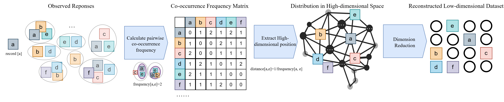

## Learning from Leakage: Database Reconstruction from Just a Few Multidimensional Range Queries

This project investigate approximate database reconstruction from range-response data. It includes a 2D pipeline using REMIN, as well as a high-dimensional attack pipeline.  schematic illustration of the REMIN reconstruction attack is shown in the figure below.

### Environment
- **Python**: 3.8+
- **Install deps** (recommended in a virtual environment)

```bash
pip install -r requirements.txt
```


### Key Terms
- **points**: all tokens/points in the dataset
- **map_to_original**: mapping from token to its ground-truth coordinate
- **responses**: all possible range responses derived from queries
- **new_responses**: sampled subset of responses used in experiments
- **unique_rs**: coordinates of tokens that appear in at least one response

---

## Run 2D pipeline (eval_exp.py)
Used to run 2D cases with t-SNE and evaluate correspondence metrics.

### Minimal example
Runs with built-in defaults and a small sample dataset.

```bash
python eval_exp.py
```

### General usage with arguments

```bash
python eval_exp.py \
  -points grid \
  -p 1 \
  -dist uniform \
  -N0 20 \
  -N1 20
```

### Arguments
- **-points**: dataset name. Examples: `grid (synthetic grid dataset)`, `drinking (Amsterdam drinking water dataset)`, `highway (Manhattan Highway Crossings dataset)`, `shopparis (Paris Shops dataset)`, `environment (Landsat Satellite dataset)`, `obesity (Obesity dataset)`.
- **-p**: percentage of responses to sample (1–100). Controls data sparsity.
- **-dist**: sampling distribution for responses; one of `beta`, `gaussian`, `uniform`.
- **-N0, -N1**: grid dimensions or dataset shape hints used by loaders/evaluators, usually 50*50 for real world dataset

Notes:
- The script plots results and prints correspondence metrics.

---

## Run high-dimensional pipeline (attack_high_dim.py)
Used to run high-dimensional cases. Interface mirrors the 2D runner with an extra dimension parameter.

### Minimal example

```bash
python attack_high_dim.py
```

### General usage with arguments

```bash
python attack_high_dim.py \
  -points grid_nd \
  -p 1 \
  -dist uniform \
  -dim 3 \
  -N 16 \
```

### Arguments
- **-points**: dataset name (e.g., `grid_nd (synthetic high dimensional datset)`, `environment_3d (Landsat Satellite dataset)`, `obesity_3d (Obesity dataset)`, or other high-dim datasets).
- **-p**: percentage of responses to sample (0–100).
- **-dist**: sampling distribution; one of `beta`, `gaussian`, `uniform`.
- **-dim**: data dimensionality (e.g., 3, 5, 10).
- **-N**: domain size for 3D/high-dimensional datasets.

---

## Repro steps at a glance
1. Create and activate a Python 3.8+ virtual environment
2. `pip install -r requirements.txt`
3. Run a minimal test: `python eval_exp.py`
4. Explore configurations with custom parameters (2D or high-dim)

## Citations and License
If you use this code, please cite appropriately. Licensing details can be added here.
